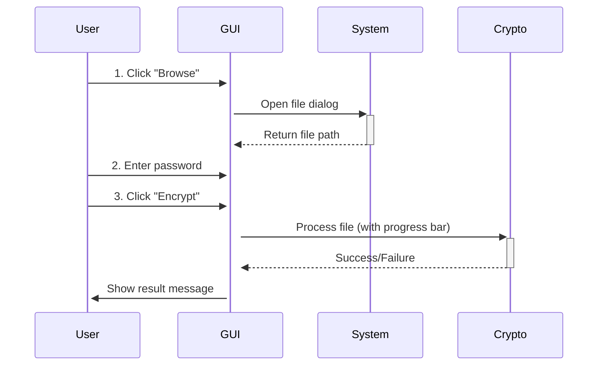

# **SecureCrypt - AES-256 File Encryption Tool** 🔒  

**A robust, user-friendly application for encrypting and decrypting files using military-grade AES-256 encryption.**  

---

## **Features** ✨  
✅ **AES-256-CBC Encryption** – Industry-standard security  
✅ **GUI & CLI Support** – For both beginners and power users  
✅ **Secure Password Handling** – PBKDF2 key derivation with 100,000 iterations  
✅ **Progress Indicators** – Real-time feedback during operations  
✅ **Cross-Platform** – Works on **Windows, macOS, and Linux**  
✅ **File Integrity Protection** – Ensures tamper-proof encryption  

---
## 🔧 Tech Stack
https://img.shields.io/badge/Python-3.7%252B-blue
https://img.shields.io/badge/Crypto-PyCryptodome-green
https://img.shields.io/badge/GUI-Tkinter-orange

## **Installation** ⚙️  

### **1. Prerequisites**  
- Python 3.7+  
- `pip` (Python package manager)  

### **2. Install Dependencies**  
```bash
pip install -r requirements.txt
```

### **3. Run the Application**  
#### **GUI Mode (Recommended)**  
```bash
python -m encryption_tool
```
#### **CLI Mode (For Advanced Users)**  
```bash
# Encrypt a file
python -m encryption_tool.cli.main encrypt myfile.txt

# Decrypt a file
python -m encryption_tool.cli.main decrypt myfile_encrypted.txt
```

---

## **User Guide** 📖  

### **1. GUI Workflow**  



#### **Steps:**  
1. **Browse & Select File** – Click the **"Browse"** button to choose any file.  
2. **Enter Password** – Type a strong password (toggle visibility with **👁**).  
3. **Encrypt/Decrypt** – Click the appropriate action button.  
4. **Wait for Completion** – A progress bar appears during processing.  
5. **Check Output** – Encrypted files get `_encrypted`, decrypted files get `_decrypted`.  

---

### **2. CLI Workflow**  

| Command          | Description                       |
|------------------|-----------------------------------|
| `encrypt <file>` | Encrypts the specified file       |
| `decrypt <file>` | Decrypts an encrypted file        |
| `--output/-o`    | Custom output filename (optional) |

**Example:**  
```bash
# Encrypt
python -m encryption_tool.cli.main encrypt secret_document.pdf --output secured_file.enc

# Decrypt
python -m encryption_tool.cli.main decrypt secured_file.enc --output restored_document.pdf
```

---

## **Technical Details** ⚡  

### **Encryption Process**  
1. **Key Derivation** – Uses **PBKDF2-HMAC-SHA256** with a **128-bit salt**.  
2. **AES-256-CBC** – Encrypts files in **Cipher Block Chaining (CBC) mode**.  
3. **Random IV** – Each encryption gets a unique **Initialization Vector (IV)**.  

### **Security Considerations**  
🔐 **Never reuse passwords** – Each file should have a unique password.  
⚠️ **Backup important files** – No recovery if password is lost.  
🚫 **Encrypted filenames are not hidden** – Consider renaming sensitive files.  

---

## **FAQ** ❓  

### **Q: Can I encrypt multiple files at once?**  
Currently, the GUI supports single-file operations. Use the CLI in a loop for batch processing.  

### **Q: What if I forget the password?**  
The file **cannot be recovered**. There is no backdoor.  

### **Q: Is this safe for sensitive documents?**  
Yes! AES-256 is used by governments and security experts worldwide.  

---

## **Future Enhancements** 🚀  
- [ ] **Drag-and-drop support**  
- [ ] **Password strength meter**  
- [ ] **Cloud storage integration (Google Drive, Dropbox)**  
- [ ] **Dark mode UI**  

---

## **License** 📜  
MIT License - Free for personal and commercial use.  

---

## **Credits** 👏  
Developed with ❤️ by **[B Blessy]**  

---

**Enjoy secure file storage!** 🔐💻  
**⭐ Star this project if you find it useful!** ⭐  

--- 